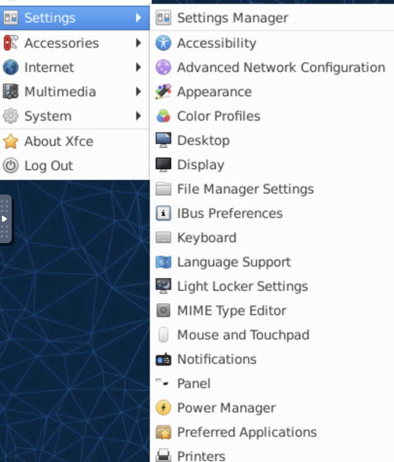
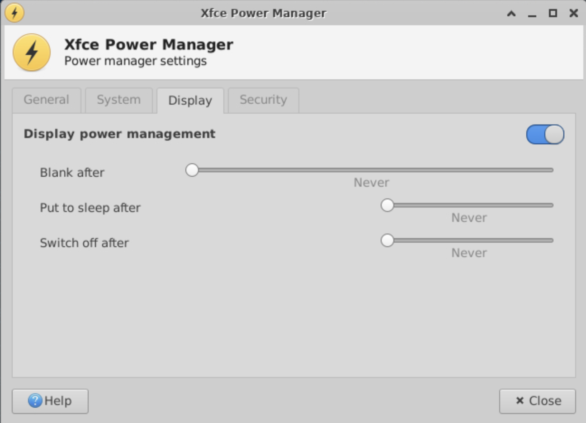

GPU enabled Docker containers for MATLAB are fantastic, but on two installations I have run across a bug that the internet is silent about.

After about 10 minutes of inactivity the VNC server will display a black screen and won't display until restarting the container.

The fix requires a few steps. Mathworks enables XFCE4 as the default GUI but did not bother to include the standard power manager utilities. So the screen either locks or times out without any way back in.

First, if you want to save your work and continue you can run the command:
`sudo docker exec -it <docker container id> /bin/bash`

to enter into the actual container in which the VNC service is running (use docker ps to search for the correct id).

Then identify the lightDM lock process which is hiding your desktop with the following command:

`sudo ps -aux | grep lock`

Once you find the correct process ID, then kill the id.


```
matlab      2108  0.0  0.0 260772 22524 pts/3    Sl   Oct14   0:03 light-locker
kill 2108
```

Your VNC client should immediately return to an unlocked state.

For a permanent fix, in a shell with the container instance, type:

`sudo apt install xfce4-power-manager`

Now, go back into the VNC session (usually by connecting to port 6080) and go to the XFCE4 settings in the GUI. You will see a new "Power" option. 




Open this application and go to the display tab. Turn all the settings to "never". 



Next, you have to exit your Docker container shell (exit) and then commit the changes to your image so the changes will remain the next time you load your container.

```
$ sudo docker ps
CONTAINER ID   IMAGE          COMMAND              CREATED      STATUS      PORTS                                                                                  NAMES
64a40d438912   matlab   "/bin/run.sh -vnc"   4 days ago   Up 4 days   0.0.0.0:5901->5901/tcp, :::5901->5901/tcp, 0.0.0.0:6080->6080/tcp, :::6080->6080/tcp   upbeat_chaplygin
$ sudo docker commit 64a40d438912 matlab2021b
sha256:945d3ce4976fbafae812551c5bae2d8f60ff8945e96b2f95d66ada15cfe13180
```

This should keep you VNC display active!