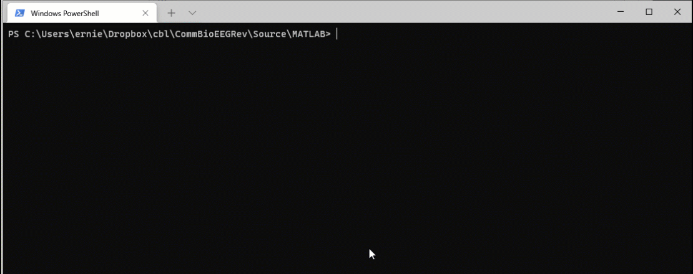

## *How easy would it be to convert an existing large MATLAB/R project to using GNU Make?*

In these tutorials, we will find out together! 

Welcome to Part II where we will start converting individual MATLAB scripts into a series of scripts that can be automatically created using the **Make** utility.

In the last tutorial, we created a combined manuscript. This manuscript contains the roadmap for what assets to create (and their order) to create a reproducible research project.

#### Platform agnostic

In this project, we are demonstrating the capabilities of MATLAB, R, and Make on the Windows platform due to it being the most challenging. For example, the Windows version of MATLAB cannot truly be run without the GUI present as either the Mac or Linux version. Also, Make must be installed on Windows, whereas it is installed by default on most Linux installations and can be installed on Mac by installing the xcode development application. 

## Automating MATLAB scripts

### It's all about targets and dependencies

The strategy for creating Make versions of MATLAB scripts remains similar to any other Make project. Focus on your target files and dependencies. Remember that each dependency must also be a target file unless it exists prior to your analysis.

For example, you might have a spreadsheet that contains clinical values and group assignments. This spreadsheet is an original asset that does not have a dependency. When you reference a Makefile, let's call it '`group_assignments.csv`', it must exist in your source folder to avoid getting an error. 

On the other hand, you might want to wrangle your `group_assignments.csv` to change group labels and exclude certain subjects. In this case, you may opt to create a new file in the Build folder named "`validated_group_assigments.csv`'. Subsequent scripts will look for this file (rather than the original) so instructions on how to create ''`validated_group_assigments.csv`" from "`group_assigments.csv`" must be specified in the Makefile. It is also good practice as your original source files remain untouched.

### Start with data models, then move on to tables and figures

The number of figures and tables in any analysis is usually equal to or greater than the number of data models. We often present data models in many different ways to make our points clear.

It plays to the strength of the **Make** approach to create one or more data *models* and then use those models as dependencies in other data *models*, *figures*, and *tables*.

## Step 1: Edit a common Matlab file that stores shared paths, variables, and functions. 

Functional programming languages like Matlab can be a joy and pain to work with. In particular, Matlab is highly dependent on specifying particular paths to the files you want to include in your project. In addition, given Matlab's relatively enormous overhead, you want to reduce the duplication of code as much as possible.

We have included a file matlab_00_common.m to serve as a common include file in each of your Malab scripts. Why the odd name? Matlab has very[ specific naming conventions](https://www.mathworks.com/help/simulink/mdl_gd/hi/naming-considerations.html) for files! If you name your file something different, just update the beginning of each of your scripts. In fact, in a complex analysis having more than one possible include file may increase your flexibility and increase the efficiency of your code.

Also, remember that we will be using Matlab both through the GUI for development and also running it from the command line for efficiency.  This forces us to write code that is both compatible by running line by line but also can run the entire file at once. Different users have various advice on how to accomplish this, but in our research we have one method that seems to work well in almost every situation.

The template is to create an Matlab script file ("m") that contains the code to create your environment as well as a main function of your analysis in the same file. We will have plenty of examples of this below for clarification. Each **Model** file should output a **MAT file** which contains variables of interest to be used by other analysis. In some cases, creating a CSV file or [Parquet ](https://www.mathworks.com/help/matlab/parquet-files.html)file may be more appropriate. 

Let's open matlab_00_common.m and update our variables to reflect our current system needs. Notice that we add two commands to ensure that the entire Matlab environment is wiped clean (including resetting default paths) prior to any operations. This is essential to making sure that your results can be replicated on new systems. Finally, the `IsBatchMode `is a logical variable that will either be `TRUE `if running from the command line (such as through Makefile) or through the interactive GUI (as during development).

```
%=========================================================================%
%                     CREATE REPRODUCIBLE ENVIRONMENT                     %
%=========================================================================%

clear all;
restoredefaultpath();
IsBatchMode = batchStartupOptionUsed;
```

Next we add variables that represent pathnames to common software toolboxes that will be used by our analysis. Since we wipe the Matlab path clean on each run, this is essential to reassigning paths on each script run. The HTP path refers to our internal tool box which contains RepMake scripts and other useful EEG functions. 

```
%=========================================================================%
%                           TOOLBOX CONFIGURATION                         %
% eeglab: https://sccn.ucsd.edu/eeglab/download.php                       %
% high throughput pipline: github.com/cincibrainlab/htp_minimum.git       %
% fieldtrip: https://www.fieldtriptoolbox.org/download/                   %
% brainstorm: https://www.fieldtriptoolbox.org/download/                  %
%=========================================================================%

EEGLAB_PATH             = 'E:/Research Software/eeglab2021';
HTP_PATH                = 'C:/Users/ernie/Dropbox/htp_minimum';
BRAINSTORM_PATH         = 'E:/Research Software/brainstorm3';
FIELDTRIP_PATH          = 'E:/Research Software/fieldtrip-master';
```

Next we customize specific paths and information regarding our dataset. This is information that should be useful to any script within this project. Notice that the MATLAB and R build paths are different. That is because my R build path is on a limited space cloud drive and the MATLAB build path is on a storage drive for larger analysis projects. It is simple to use the same path if desired. 

Finally, the format our datasets are stored in is consistent with our high throughput pipeline (htp) which makes "objects" for each piece of EEG data (which point to a large EEG data file). This includes a CSV file and a MAT file of the objects. This code could be removed and replaced with your custom form of loading data such as in a cell array. 

```
%=========================================================================%
%                        DIRECTORY CONFIGURATION                          %
%=========================================================================%
syspath.MatlabBuild  = 'E:/data/CommBioEEGRev/MatlabBuild/';
syspath.RBuild       = 'C:/Users/ernie/Dropbox/cbl/CommBioEEGRev/Build/';

% adding both build folders to MATLAB path
cellfun(@(x) addpath(x), {syspath.MatlabBuild, syspath.RBuild}, 'uni',0)

%=========================================================================%
%                          DATA CONFIGURATION                             %
%=========================================================================%
syspath.htpdata  = 'E:/postdata/P1_70FXS_71_TDC/';
keyfiles.datacsv = fullfile(syspath.htpdata, 'A00_ANALYSIS/A2109130720_subjTable_htp2bst_Stage4.csv');
keyfiles.datamat = fullfile(syspath.htpdata, 'A00_ANALYSIS/A2109130720_subjTable_htp2bst_Stage4.mat');
```

Finally, under custom functions you can place any functions that may be used by other project scripts. In this case, I have a simple class called repMakeClass which contains useful functions for working with Makefiles.

```
%=========================================================================%
%                          CUSTOM FUNCTIONS                               %
%=========================================================================%
r = repmakeClass;
```

When this is complete, try running your matlab_00_common.m file. Not much will happen, however, your Matlab environment will be prepared for the next steps!

## Step 2: Generating a Data model from the command line through Make

The fruit of all your labor setting up the environment will pay off in this next section. At this point, you will notice a dramatic decrease in the size of your script files because you are really only asking your script file to accomplish one major goal.

For the next task, we will load our EEG dataset and save the relevant details in a MAT file for further use. Given the potential for high storage needs, we will use the MATLAB Build folder instead of the R build folder.

We are going to use our template to basically create the following script:

1. Data file in
2. Computation or creation
3. Data file out


### A. Include the common Matlab file of your choosing to set the environment

Start with opening the `model_template.m` file.  This generic template can be used to create a MAT file from MATLAB code. After reading the header instructions you will notice our common include file (easy to change). Remember that the **Common** file will clear your current environment, so save any work or variables you need now!

```
%=========================================================================%
% Step 1: Load common packages, data, and functions.                      %
% ========================================================================%
matlab_00_common
```

### B. Add a **basename** that will keep your file names consistent. 

The **basename** is a critical variable to ensure the naming of your file stays extremely consistent through this process. Our recommendation is that any Build file should match the source file name with the addition of the type of asset that it is. This will allow you to keep track of hundreds of files with very little confusion. In this case, we name the **basename** "loadDataset" and the target files will be automatically called 'model_loadDataset'. 

```
%=========================================================================%
% Step 2: Customize basename for script                                   %
%=========================================================================%

basename    = 'loadDataset'; % Edit
prefix      = ['model_' basename];
```

### C. Specify any preexisting data you need in your current file

For most projects, data models will require additional input from preexisting data files. This section is reserved for any variables that you would like to create to be used by the rest of the script. Our default setup includes the option of loading a MAT file. We make generous use of the MATLAB `missing` keyword in these scripts as an easy way of telling what parameters are active or not. 

### D. Develop and Run the Data Model in the MATLAB GUI

```
%=========================================================================%
%                            CONSTRUCT MODEL                              %
%=========================================================================%

p = htpPortableClass;   % MATLAB object / methods / properties
p.importDataObjects( keyfiles.datacsv, keyfiles.datamat, syspath.htpdata );
p.updateBasePaths( syspath.htpdata );

%=========================================================================%
%                          EXPORT ENVIRONMENT                             %
%=========================================================================%

save(target_file, 'p', 'syspath', 'keyfiles')

```

The hard work from the previous sections have now paid off! Let's look at the actual code for loading our dataset and saving it to a MAT file. Here we are using htp functions (from our pipeline toolkit) to load the information to our raw data files, update their relative file paths, and then save the variable in a MAT file. 

The target file `Build\model_loadDataset.mat` can now be used across multiple other asset scripts. 

### E. Final Step: Automate the Data Model Build using Make

Next, we will automate this relatively simple Build using **Make**. Open your template `Makefile` and let's make some edits. Remember that **Make** loves ***shorthand*** so don't be intimidated by any of the syntax!

#### Test if your MATLAB is working from the command line

MATLAB must work from the command line for Make to activate and run your script! Let's test our MATLAB command in a terminal window (should work on Mac, Windows, or Linux).  In this case, I am going to open Windows terminal and run the command `matlab -nogui -nosplash -batch` . If matlab is available, Windows will complain that the nogui option is invalid (this is for Linux and Mac) but essentially tell you that it needs a script to run. Troubleshooting instructions [here](https://www.mathworks.com/help/matlab/ref/matlabwindows.html).


### Edit our Makefile: Setup short cuts

After reading the header, notice the first section defining shortcuts used by **Make** for the rest of the file. In particular confirm you MB (Matlab build directory) and your B (Build directory) are correct. **Make** syntax is simple but rigid: no extra spaces! Don't forget to end your path with a "/" so it seamlessly fits into the filename when you use it later.

> Don't forget to flip your `\` to `/` when you are using Windows for maximal compatibility. 

```
#==============================================================================#
#                               CONFIGURATION                                  #
#==============================================================================#
# SHORTCUTS        ============================================================#
#                  definition: shortcut [commands or paths]                    #
#                  usage: $(shortcut)                                          #
#==============================================================================#
SHELL=/bin/bash
R = RScript --verbose
Matlab = matlab /minimize /nosplash /nodesktop /batch
MB = E:/data/CommBioEEGRev/#MATLAB Build
B = C:/Users/ernie/Dropbox/cbl/CommBioEEGRev/Build/
S = Source/
```

### Edit the Makefile to include our top-level "recipes"

Next, we add our highest level targets to Makefile. At the highest level, we define `all `as depending on `matlab`. `matlab` refers to a series of dependencies that are the output of each of our MATLAB scripts. 

Since we currently only have one script, our recently created `model_loadDataset.m` the remainder of our Makefile will be quite short. 

### Add an entry to tell Make how to create `model_loadDataset.m`

Let's create recipe to create our first target file `model_loadDataset.m`. 

```
#==============================================================================#
# MATLAB RECIPIES                                                              #
#==============================================================================#
# MODEL: Import EEG dataset information
$(MB)model_loadDataset.mat: model_loadDataset.m
	$(Matlab) "target_file='$@';, run $^"
```

Let's make sense of this **Make shorthand!**

* Any line that starts with # is simply a comment. 
* the `:` is the dividing marker between the `target file` and the `dependencies`
* following the last dependency, a `new line` and a `tab` tells **Make** to pay attention to a command
* a `tab` is NOT a few spaces, but an actual tab character
* When you see a `$` and `()` think either variable or function
* `$@` is a short hand to refer to the `target file` or what is left of the `:`
* `$^` is short hand to refer to the right of the `:` or all the `dependencies`
* The MATLAB shorthand is used in this code as defined at the beginning of the file. It would be equally valid to use the command spelled out: `matlab /minimize /nosplash /nodesktop /batch`
* To specify the target file that we want, we added it directly as an variable in the batch command. To be more clear, `"target_file='$@';, run $^"` instructs Make to place the filename of the target file (`$@`) and replace the `$^` with the script name from the dependency. 
* Remember that Make is not analysis software. It is a very sophisticated macro software. You could simply run the command (without the shorthand) from the Makefile on the command prompt to test if it works.

Let's try that now!

First identify the working directory of your new Makefile and MATLAB scripts:


Next, open a terminal window and change to your working directory. Finally run the command `make matlab`. To break the suspense, since you have already tested these scripts in the GUI, they should work fine from the command line. Remember, that we have ensured a fresh clean environment with each run. If you forget to define the `target_file `in the MATLAB command from **Make** you will end up with whatever default name you specified in the file. 



Breath a sign of relief! From here on out we simply repeat this process adding Makefile entries as you build your scripts. With just on