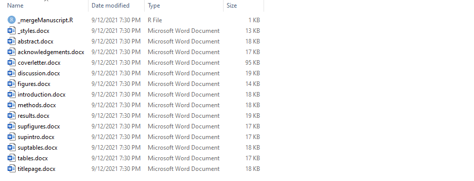

## *How easy would it be to convert an existing large MATLAB/R project to using GNU Make?*

In these tutorials, we will find out together! 

## Why convert an existing analysis project?

We recently began a revise and resubmit of our [EEG source localization preprint](https://www.medrxiv.org/content/10.1101/2021.05.12.21256925v1) to Communications Biology. This revision required new analyses and substantial changes to the manuscript. 

Though our previous code and datasets were sharable, they required extensive hands-on operation to reproduce our results. In 2020, I felt this code base was amazingly modular. 

Today in late 2021, having designed the [repMake](https://github.com/cincibrainlab/repmake) framework what could compete with:

```shell
make manuscript
```

## Overview of the entire process

The focus of the process should be on the manuscript, not the analysis code itself. This is minor distinction but I feel makes a big difference in the execution of working with a large research project. It is far too easy to get caught up in the minutia *how* to write something rather than *what* is actually for. 

### Overview of creating a REProducible MAKE Manuscript from an existing project:

1. Split manuscript into individual sections
2. Identify data models, tables, and figures that need corresponding scripts
3. Create a common function file and a master caption file
4. Start with transition code to construct each data model
5. Write code for each table and figure
6. Compile manuscript using Make

This process will be overly difficult because of how we programmed our initial analysis. The MATLAB code required the use of a graphical user interface (GUI) and the R code similarly required an open R Studio session. In the revision, we will streamline this code to be entirely run from the command line. 

In our development process, the GUI still plays a crucial role. Using a GUI to recreate an analysis once it has been finalized, however, can lead to errors. In a GUI, settings or parameters must be entered manually. Alternatively, by converting your final code into a command line script, every parameter and modification must be recorded. This transparency is *[crucial to reproducibility](https://ropensci.github.io/reproducibility-guide/sections/introduction/)*. 

## Design Principals of the RepMake Conversion

Instead of having a single script for each manuscript asset, we coded our analysis by topic. At the time, this seemed efficient, but wading through the code nearly a year later has been challenging! When coding large, multipurpose scripts there are too many "what was I thinking when I wrote this" or "what else did this script do". Indeed, if the authors of the scripts feel this way, imagine how the public would feel!

In our revision:

1. One script = One manuscript asset
2. Each script should be able to run as a standalone command
3. MATLAB or R scripts should clearly list inputs and outputs
4. The main manuscript and supplement including all tables and figures should be able to be built from the source EEG files.

The last point may seem like a tall order, however, this is exactly what GNU Make was designed for. Remember, Make is only interested in the *filenames* and the *date/time* they were modified. In this way, Make is application agnostic - if you can build it, Make can use it!

## Step 1: Gather RepMake template to a new project directory

The next step is to retrieve or clone the RepMake repository to get the GNU Make templates we will use in our conversion. We could do this by creating a blank directory and unziping a copy of the files, but I would recommend an alternative method.

The more I use RStudio, the more I appreciate it. RStudio is well integrated with Git version control and has a built in terminal with superpowers (wlll discuss later!). More importantly, by incorporating R studio at this step we can also generate our combined manuscript immediately. 

Also, for most of us, our statistical program is the penultimate step prior to the manuscript. My final steps are primarily in R (or in the past SPSS or SAS) to generate tables and figures to incorporate into my manuscript. By having R be the begining of your process, you ensure a smooth transition on your final steps.

Let's use the following menu order to create a new project from a Git repository:

File -> Create New Project -> From repository

Use the following settings below for the Repository URL and specify your own directory name (here I name it for the revision manuscript I am working on) and a subfolder. 

I know some people use version control exclusively. I actually continue to main my R projects on a cloud hosting service, in this case Dropbox. There are unusual errors that can occur when using Git and Dropbox together, but the ability to truly restore files and share with others who may not be, eh familiar with Git, is an important factor.


#### Create an empty Build folder

After this is complete, use the "New Folder" button to create a new directory called Build. 


This will be your main Build folder. The output of your asset scripts (i.e. , model\_, table\_, figure_) will fall into this folder. However, there are times in which your projects may need additional space or reside in on a different computer. Especially during our MATLAB scripts, we have specified an alternative Build folder (called MatlabBuild) that can be used in a directory that has more storage capacity and outside the repository or cloud folder.

#### Update .gitignore (optional)

The .gitignore file keeps track of the files and folders you need to keep in your repository and those you do not. In this case, the Build folder is kept out of your online repository. Remember, the files within the Build folder can be created 100% from the source files. To accomplish this, simply open the .gitignore file in R studio and add the line Build/ to "ignore" it in future Git remote commands.


## Recreating your manuscript to create a blueprint for the remainder of the process

We will next create individual Word documents for each section of our manuscript. These individual documents can be later "stitched" together during the Build process using a single Make command.

#### *Word documents?*

Although we know the advantages of other document formats, such as Google docs, Markdown or Latex, we still use Word format (and \*gasp\* Endnote). We have access and occasionally use tools like Overleaf or Authorea. 

Even more interesting, Markdown and Latex remain integral to our RepMake framework serving a central role in the caption system. **However, we ultimately convert everything to a Word document for dissemination.** 

It is not hard to explain why so many researchers stick with the Word + Endnote combination. 

* Many major medical journals require Word documents for submission
* Shared Endnote libraries across research collaborators
* Track changes in Word
* Complex formatting and styles can easily be shared in Word documents

With all this being said, it is fairly trivial to modify our current code to use any other type of document file. 

## How to convert your manuscript into individual word sections

You will find the manuscript templates in the folder:

`Source/manuscript`

There are two notable files:

**_mergeManuscript.R**: used to combine individual document files into single documents.

**_styles.docx**: a blank Word template that contains the styles to apply to the rest of the combined document. 

The current templates have been created with a Nature-style manuscript in mind. Keep in mind that these sections are 100% customizable. In the actual **Makefile** you will specify which filenames and which order to combine them in.  

For example, you may want to have your title page, acknowledgements, and abstract in a single document. Just create a single Word file (title_ack_abstract.docx) and specify it in the **Makefile** by replacing the three separate files.

You may want to have a specific separate References page. In this case, create the Word file (i.e. bibliography.docx) and add it to the main manuscript section in the **Makefile**.



## Add/Edit each template and remove any unnecessary files

There is nothing particularly fancy about this next step. I will carefully open my original manuscript and cut/paste each section into each template. 

## Let's try to put this manuscript back together!

One might wonder why separating your document into individual sections is better than keeping it combined. Hopefully after working through the next section, the benefits will be obvious!

The next step is to open the template Makefile. This version of the Makefile should work across platforms (Windows, Mac, and Linux). 

## Reviewing the Makefile line by line

You will notice that lines 8 to 12 are essentially defining convenience variables to make our code look leaner. It is important to look at this section so the code in the remainder of the Makefile makes sense!

Line 8: Specifies the command shell (ignored in Windows)

Line 9: "R" is a shortcut referring to the command line version of R

Line 10: "Matlab" is the shortcut for the command line version of Matlab. You will note the extra 'flags' used to make Matlab behave at the command line instead of opening a new Matlab window!

Line 11: B is a shortcut for the Build folder

Line 12: S is a shortcut for the Source folder

```
#==============================================================================#
#                               CONFIGURATION                                  #
#==============================================================================#
# SHORTCUTS        ============================================================#
#                  definition: shortcut [commands or paths]                    #
#                  usage: $(shortcut)                                          #
#==============================================================================#
SHELL=/bin/bash
R = Rscript --verbose
Matlab = matlab -nogui -nosplash -batch
B = Build/
S = Source/
#==============================================================================#

```


## Completed Part I of the Large Project Conversion Tutorial

At the end of this tutorial you will have:

1. Created a new project folder containing template files from the RepMake repository.
2. Each section of your manuscript should be in a separate Word file.
3. You have a combined manuscript Word document in your Build folder

Seems like a lot of work to basically end up with what you started, but trust me, the fun is just beginning!