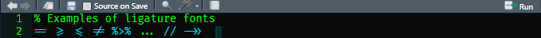

## **What are ligature fonts?**

We often use symbols in our programming code that take multiple characters, but have a single meaning. Ligature fonts take sequences of these characters and make a pleasant single 'token' that is easy to read and make code more readable.

## **What common symbols would a ligature font make more readable?**

Consider common sequences like `->>`, `==`, or `%>%`. Watch how a common ligature font, Fira Code, would display a variety of symbols!


## How do you install ligature fonts?

[@tonsky](https://github.com/tonsky) has generously created and made Fira Code freely available through a Github repository: <https://github.com/tonsky/FiraCode>

There are numerous ways to[ install this font on windows, mac, and linux](https://github.com/tonsky/FiraCode/wiki/Installing). The fonts can be used in many programming language editors, but [some editors](https://github.com/tonsky/FiraCode/wiki) will need you to explicitly "turn on ligature support".

### Example of installing Fira Code on Windows using a [Scoop](https://github.com/lukesampson/scoop) package:

I thought I would try a new method of installing a font on my current Windows build that does not have Fira Code installed. Scoop is a Windows package manager. If you haven't used a package manager before, I would highly recommend learning more. A package manager can install and uninstall programs through the command line - which can be far more efficient than installing packages through the "download, pick, and click" method. 

#### Step 1: Install Scoop package manager on Windows

Having a good command line tool in Windows is essential. You could perform the following instructions on the default Windows Powershell, but I would recommend installing Microsoft revamped cross-platform Powershell replacement, [Windows Terminal](https://aka.ms/pscore6). 

#### Step 2: Run Powershell or Windows Terminal in Administrative Mode

> Alas, I hate in Windows we need to elevate our privledge level for a font installation.

a. Adjust installation privileges by running:

`Set-ExecutionPolicy -ExecutionPolicy RemoteSigned -Scope CurrentUser`

c. install Scoop with the following command:

`iwr -useb get.scoop.sh | iex`

#### Step 3: Install Fira Code font with the following commands:

```powershell
scoop bucket add nerd-fonts
scoop install firacode
```

#### Step 4: The new font should be activated in each program editor you use.

In R Studio, for example, use Tools -> Global Options -> Appearance -> Font and switch to Fira Code.



That's it! If you want to see four other ligature fonts, visit[ betterwebtype.com](https://betterwebtype.com/articles/2020/02/13/5-monospaced-fonts-with-cool-coding-ligatures/).