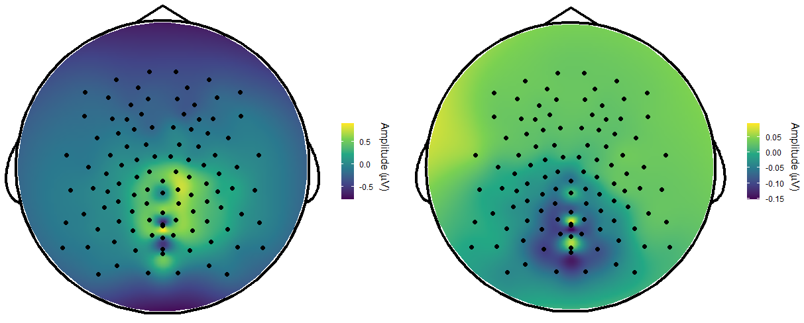

## Have you wanted to plot 2D EEG topography in R? [Thanks to github user craddm you can!](https://github.com/craddm/eegUtils/)

To date, most of our publications topography figures have been created in MATLAB. The topographic images are either created with EEGLAB function (the venerable topoplot), Brainstorm, Cohen's modification of the topoplot, or for 3D views, Brainnet Viewer. 

With our recent interest in using MATLAB primarily for computation and R for visualization, I was happy to see great progress on EEG visualizations in R. What are the advantages? For one, having topographic features in dataframes allows for easy group averaging or modeling with other R functions. 

Today, we are going to do a brief tutorial on plotting an EEG measure on topography using the functions from the eegUtils package.

Overview of steps:

1. Have an example EEG file available for channel configuation (EEGLAB set preferred)
2. Have your data arranged into two columns: channel and value
3. Execute the topoplot function from the eegUtils package

First install the package and any dependencies:

```
remotes::install_github("craddm/eegUtils@develop")

```

Unless you have  Biosemi net (which has built in montages) open a sample EEG file with the same net montage as you want to plot. I had a set file from my original data that I used.

```
EEG <- import_set(file_name = "D0079_rest_postcomp.set")

```

Once the SET file loads, R will store the channel locations within the variable under the field chan_info:

```
EEG$chan_info
 EEG$chan_info
    electrode radius theta phi        cart_x      cart_y      cart_z       x
1          E1      1  -108 -44 -5.787678e+00  5.52086322 -2.57746864  -77.69
2          E2      1   -88 -52 -5.291805e+00  6.70909756  0.30743490  -54.18
3          E3      1   -70 -63 -3.864122e+00  7.63424051  3.06777014  -31.78
```

I recommend storing this table into a variable chan_info and then into an RDATA file to use in subsequent analysis.

```
chanlocs <- EEG$chan_info
save(file = 'egi128_chanlocsR.RDATA', chanlocs)
```

Wrangle your data into long format and make sure you have a value column and a channel name column. The number of rows should be approximately the number of channels. Occasionally, as in my case, you may want to only plot a subset of channels. In the following example I will plot only the "scalp" channels from a single subject. The value of interest is a component derived from generalized eigenvalue decomposition.

```
eeg.map
> eeg.map
# A tibble: 108 x 3
   eegid      chan    value
   <chr>      <chr>   <dbl>
 1 D0079_rest E1    -0.233 
 2 D0079_rest E2    -0.229 
 3 D0079_rest E3    -0.271 
 4 D0079_rest E4    -0.224 
 5 D0079_rest E5    -0.223
```

To correctly use the function, make sure you rename the value column you want to use "Amplitude" and the channel column you want to use "Electrode". You can do it within the function using pipes as below. I prefer not to change the name in the dataset so I keep the columns accurate to the data being plotted. This allows you flexibility to plot averaged or single subject data of any time including p or t-values. 

```
topoplot(eeg.map %>% rename(electrode = chan, amplitude=value), palette = "inferno", 
         chanLocs = chanlocs, contour = FALSE,interp_limit = "head" )

```

There are lots of formatting features available as function parameters. In this case, I turned off contour lines and modified the color scale. Having followed the previous discussions of the difficulties of developing topoplot  in R, I am pretty impressed with the results. The interpolation of the space is performed by a generalized additive model. 



The package has more advanced features including interactive Shiny components. I will continue to explore and post any new tutorials on other data types.